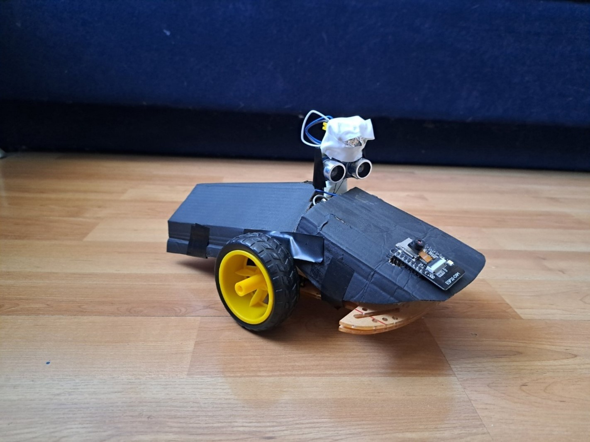
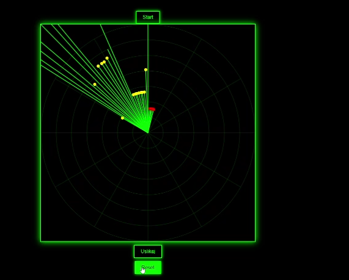

# Thenkich - Mobile Robot with Sonar Radar & Thermal Target Verification

An embedded dual-microcontroller mobile robotics platform that integrates autonomous obstacle avoidance, panoramic sonar radar sweep mapping, passive infrared (PIR) living-target discrimination, and real-time visual inspection via an onboard web interface.

---

## Hardware Overview

  
*Figure 1: Physical build of the Thenkich mobile robot showing the differential drive chassis, forward-facing ESP32-CAM unit, and the elevated pan-servo mechanism hosting the HC-SR04 ultrasonic transducer and HC-SR501 PIR sensor.*

---

## Table of Contents

* [Features](#features)
* [Sonar & Telemetry Dashboard](#sonar--telemetry-dashboard)
* [Tech Stack](#tech-stack)
* [Hardware Pin Mapping](#hardware-pin-mapping)
* [Prerequisites](#prerequisites)
* [Installation and Setup](#installation-and-setup)
  * [1. Clone Repository](#1-clone-repository)
  * [2. Install Dependencies](#2-install-dependencies)
  * [3. Environment Configuration](#3-environment-configuration)
  * [4. Compilation and Flashing](#4-compilation-and-flashing)
* [Usage](#usage)
  * [WebSocket Protocol Specification](#websocket-protocol-specification)
  * [HTTP Endpoints (ESP32-CAM)](#http-endpoints-esp32-cam)
  * [CLI Interaction Examples](#cli-interaction-examples)
* [License](#license)

---

## Features

* **Differential Drive Propulsion:** Powered by dual continuous-rotation MG90S micro-servos calibrated for bi-directional traversal and precise zero-radius pivot maneuvers.
* **Panoramic Sonar Radar Sweep:** Actuated by a dedicated $180^\circ$ positional MG90S servo carrying an HC-SR04 ultrasonic rangefinder (active detection range up to $400\text{ cm}$).
* **Pyroelectric Target Classification:** Collimated HC-SR501 PIR sensor detects thermal signatures, distinguishing living beings from inert static obstacles.
* **Autonomous Finite State Machine (FSM):**
  * Core states: `IDLE`, `TURNING`, `MOVING_FORWARD`.
  * Anti-oscillation guards: $300\text{ ms}$ turn burst (`TURN_TIME`) followed by a $400\text{ ms}$ straight-lock delay (`FWD_LOCK_MS`) to suppress immediate sensor jitter.
  * Evasive maneuver: Clockwise avoidance burst when an unverified obstacle is within $\le 20\text{ cm}$.
  * Target homing & handoff: Proportional directional tracking toward thermal signatures within $< 50\text{ cm}$; automated complete stop at $\le 20\text{ cm}$ transferring control to the user.
* **Non-Blocking Cooperative Scheduling:** Managed via `TaskScheduler` with separated periodic loops:
  * `tDistance` ($120\text{ ms}$): Acoustic ranging, PIR sampling, sweep indexing, and telemetry broadcast.
  * `tMovement` ($100\text{ ms}$): Navigation FSM evaluation and servo drive updates.
* **Real-Time Telemetry & Web Interface:** Self-hosted asynchronous web server with full-duplex WebSocket (`/ws`) delivering live polar coordinates and control commands (`start`, `reset`).
* **Visual Target Verification:** Secondary ESP32-CAM HTTP service delivering uncompressed raw VGA frames ($640 \times 480$, RGB565) via `/capture` with client-side canvas decoding.

---

## Sonar & Telemetry Dashboard

  
*Figure 2: Real-time HTML5 Canvas sonar radar displaying the $180^\circ$ polar scanning sweep. Red markers denote inert physical obstacles detected by acoustic echo, while yellow markers highlight targets confirmed by both acoustic echo and PIR thermal detection.*

---

## Tech Stack

### Hardware Components

| Component | Model / Specification | Purpose |
| :--- | :--- | :--- |
| Primary MCU | ESP32 DevKit v1 (ESP-WROOM-32) | Core FSM logic, sensor polling, motion control, WebSocket server |
| Camera MCU | AI-Thinker ESP32-CAM (OV2640) | Raw VGA video frame capture and dedicated HTTP image server |
| Drive Motors | $2\times$ TowerPro MG90S ($360^\circ$) | Continuous-rotation differential wheel drive |
| Sweep Actuator | $1\times$ TowerPro MG90S ($180^\circ$) | Pan mechanism for directional sensor sweep |
| Rangefinder | HC-SR04 | Ultrasonic time-of-flight acoustic distance measurement |
| Thermal Sensor | HC-SR501 PIR | Pyroelectric infrared body heat detection |
| Protection & Power | 1N5819 Schottky, $2\times 470\,\mu\text{F}$, $2\times 100\text{ nF}$ | Reverse-polarity protection and transient decoupling filter network |

### Software & Firmware Libraries

| Domain | Library / Technology | Description |
| :--- | :--- | :--- |
| Firmware Framework | C++ / Wiring (ESP-IDF core) | Native firmware execution on 32-bit Xtensa Dual-Core LX6 |
| Multitasking | `TaskScheduler` | Cooperative non-preemptive task scheduling |
| Servo PWM | `ESP32Servo` | Hardware timer allocation ($50\text{ Hz}$ refresh rate) |
| Async Networking | `AsyncTCP`, `ESPAsyncWebServer` | Asynchronous web server and WebSocket transport |
| Video Driver | `esp_camera`, `WebServer` | Parallel camera bus capture and HTTP transport |
| Frontend Dashboard | HTML5 Canvas, Vanilla ES6, CSS3 | Dynamic polar coordinate radar visualization and controls |

---

## Hardware Pin Mapping

### ESP32 DevKit v1 (Main Controller)

| Pin | Peripheral Function | Direction | Electrical Specification |
| :--- | :--- | :--- | :--- |
| `GPIO14` | Left Wheel Drive Servo | OUTPUT (PWM) | Continuous servo pulse ($50\text{ Hz}$) |
| `GPIO27` | Right Wheel Drive Servo | OUTPUT (PWM) | Continuous servo pulse ($50\text{ Hz}$) |
| `GPIO19` | Radar Sweep Servo | OUTPUT (PWM) | Positional servo pulse ($0^\circ - 180^\circ$) |
| `GPIO25` | HC-SR04 TRIG | OUTPUT | $10\,\mu\text{s}$ digital trigger pulse |
| `GPIO33` | HC-SR04 ECHO | INPUT | Input-only; requires level shifting ($5\text{ V} \to 3.3\text{ V}$) |
| `GPIO32` | HC-SR501 PIR OUT | INPUT | Input-only; active-high digital signal |

### AI-Thinker ESP32-CAM

| Signal Identifier | Board GPIO | Functional Role |
| :--- | :--- | :--- |
| `PWDN` / `RESET` | `GPIO32` / `-1` | Power down control / Software reset line |
| `XCLK` / `PCLK` | `GPIO0` / `GPIO22` | External camera master clock ($20\text{ MHz}$) / Pixel clock |
| `VSYNC` / `HREF` | `GPIO25` / `GPIO23` | Vertical / Horizontal frame synchronization lines |
| `SIOD` / `SIOC` | `GPIO26` / `GPIO27` | I2C SCCB data and clock communication bus |
| Data Bus (`D0` - `D7`) | `GPIO5, 18, 19, 21, 36, 39, 34, 35` | 8-bit parallel digital video port |

---

## Usage

Access the live dashboard by opening a web browser and navigating to the IP of the main controller:

```text
http://<MAIN_CONTROLLER_IP>/
```

### WebSocket Protocol Specification

The main controller hosts a full-duplex WebSocket endpoint at `/ws`.

#### Inbound Commands (Client $\to$ Robot)

| Payload | Function | FSM State Effect |
| :--- | :--- | :--- |
| `start` | Initiates autonomous scanning and movement. | `systemStarted = true`, `haveMeasure = false` |
| `reset` | Executes a $600\text{ ms}$ clearing pivot turn right and clears locks. | `systemStarted = true`, `haveMeasure = false` |

#### Outbound Telemetry (Robot $\to$ Client)

Telemetry is transmitted every $3^\circ$ of sweep motion as a comma-separated tuple:

$$
\text{angle},\text{distance},\text{pir\_status}
$$

| Field | Type | Domain | Description |
| :--- | :--- | :--- | :--- |
| `angle` | Integer | $10 - 170$ | Re-mapped polar angle ($^\circ$) for radar canvas rendering |
| `distance` | Integer | $0 - 400$ | Acoustic time-of-flight distance in centimeters ($\text{cm}$) |
| `pir_status` | Boolean | `0` or `1` | `0` = No thermal activity; `1` = Living target detected |

*Example:* `90,34,1` indicates an object directly ahead at $90^\circ$, $34\text{ cm}$ away, with positive thermal emission.

---

## License

This project is licensed under the **MIT License**.